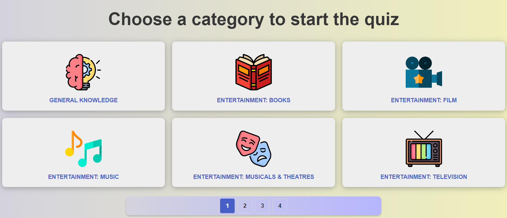
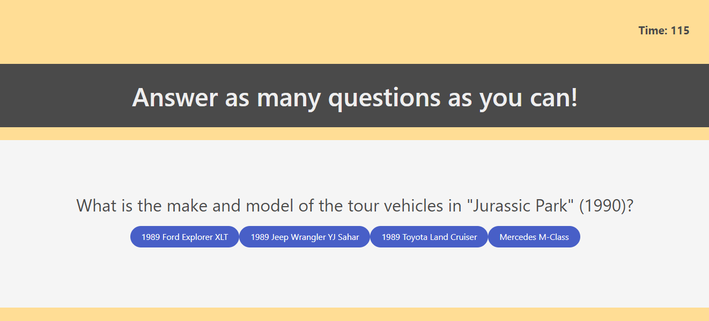
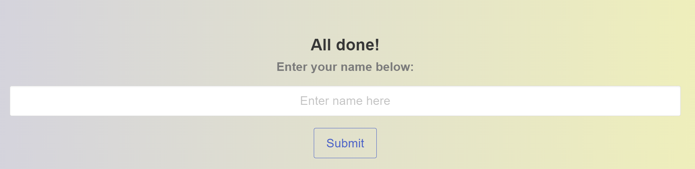
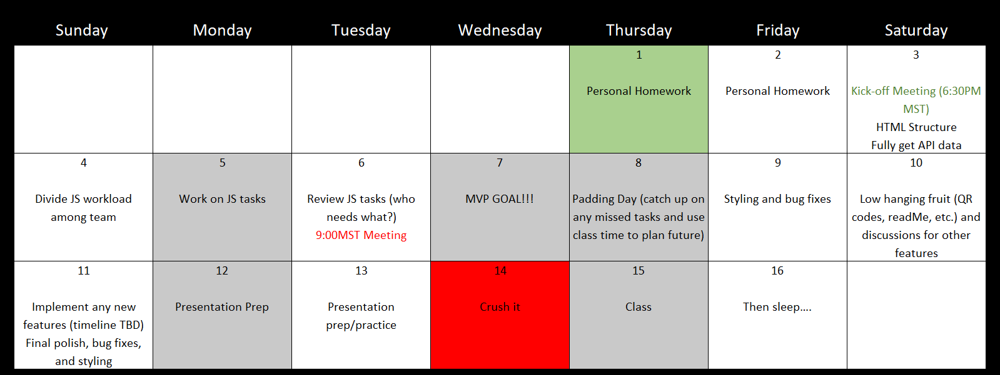

[![Contributors][contributors-shield]][contributors-url]
[![Forks][forks-shield]][forks-url]
[![Stargazers][stars-shield]][stars-url]
[![Issues][issues-shield]][issues-url]
[![MIT License][license-shield]][license-url]

 

  

<h3 align="center">Break the Scroll!</h3>

  

The ultimate tool to help users engage their mind and unplug from their phone
     
    <a href="https://github.com/beckpull/break-the-scroll"><strong>Explore the docs »</strong></a>
     
     
    <a href="https://beckpull.github.io/break-the-scroll/">View Demo</a>
    ·
    <a href="https://github.com/beckpull/break-the-scroll/issues">Report Bug</a>
    ·
    <a href="https://github.com/beckpull/break-the-scroll/issues">Request Feature</a>
  

<!-- TABLE OF CONTENTS -->

  
Table of Contents

  <ol>
    <li>
      <a href="#about-the-project">About The Project</a>
      <ul>
        <li><a href="#built-with">Built With</a></li>
      </ul>
    </li>
    <li><a href="#usage">Usage</a></li>
    <li><a href="#roadmap">Roadmap</a></li>
    <li><a href="#license">License</a></li>
    <li><a href="#contact">Contact</a></li>
  </ol>

<!-- ABOUT THE PROJECT -->
## About The Project

This webpage is meant to encourage users to stop the mindless scrolling on TikTok, Reddit, Instagram, or whatever media they’re too plugged into. When users scan the QR code, they’re presented with a trivia game that is meant to engage their mind, and then they’re given a suggestion of something to do that’s not on their phone. 

(<a href="#readme-top">back to top</a>)

### Built With

* [![JQuery][JQuery.com]][JQuery-url]
* ![bulma]
* SweetAlert
* Bored API
* Open Trivia DB API

(<a href="#readme-top">back to top</a>)

<!-- USAGE EXAMPLES -->
## Usage

When users begin the trivia game, they are first asked to choose a category and difficulty. The button clicks for the category and difficulty are used to define the parameters of the trivia fetch URL. After these parameters are established, a unique token is appended to the end of the URL which ensures that questions will never repeat for that game. 

The user then has 120 seconds to answer as many trivia questions as they can in their respective category. For each question they answer, a five second timed modal pops up telling them if they got the answer correct or incorrect. The main timer countdown pauses during the presence of the modal.  

When they reach the end of the trivia game, they enter submit their name to appear on a high score page. Their information is stored in local storage so that it persists upon repeat playthroughs. 

On the high score screen, they can see their scores for this game and past games. This is also the point where they are presented with a suggestion on something to do off their phone. They can either choose to comply with the suggestion or decide to play the game again. 

(<a href="#readme-top">back to top</a>)

<!-- ROADMAP -->
## Roadmap
Below is the project roadmap that was used in the planning, development, and deployement phases of the "Break the Scroll!" project: 

See the [open issues](https://github.com/beckpull/break-the-scroll/issues) for a full list of proposed features (and known issues).

(<a href="#readme-top">back to top</a>)

<!-- LICENSE -->
## License

Distributed under the MIT License. See `LICENSE.txt` for more information.

(<a href="#readme-top">back to top</a>)

This application uses data from the [OPEN TRIVIA DATABASE API](https://opentdb.com/) by [PIXELTAIL GAMES LLC.], available under the [Creative Commons Attribution-ShareAlike 4.0 International License]

This application uses data from the [Bored API](https://www.boredapi.com/) by [Bored API], available under the [Creative Commons Attribution-ShareAlike 4.0 International License]

This project uses the following third-party libraries:
- [SweetAlert](https://sweetalert.js.org) for creating beautiful, responsive dialogs.
- [jQuery](https://jquery.com) for simplifying HTML document traversal, event handling, and animation.
- [Bulma](https://bulma.io/) for designing responsive and mobile-first websites.

<!-- CONTACT -->
## Contact

Becky Feltman - https://github.com/beckpull

Silvia Reyes - https://github.com/NathaliaReyes

Jordan Heersink - https://github.com/jheersink8

Project Link: [https://github.com/beckpull/break-the-scroll](https://github.com/beckpull/break-the-scroll)

(<a href="#readme-top">back to top</a>)

<!-- MARKDOWN LINKS & IMAGES -->
<!-- https://www.markdownguide.org/basic-syntax/#reference-style-links -->
[contributors-shield]: https://img.shields.io/github/contributors/beckpull/break-the-scroll.svg?style=for-the-badge
[contributors-url]: https://github.com/beckpull/break-the-scroll/graphs/contributors
[forks-shield]: https://img.shields.io/github/forks/beckpull/break-the-scroll.svg?style=for-the-badge
[forks-url]: https://github.com/beckpull/break-the-scroll/network/members
[stars-shield]: https://img.shields.io/github/stars/beckpull/break-the-scroll.svg?style=for-the-badge
[stars-url]: https://github.com/beckpull/break-the-scroll/stargazers
[issues-shield]: https://img.shields.io/github/issues/beckpull/break-the-scroll.svg?style=for-the-badge
[issues-url]: https://github.com/beckpull/break-the-scroll/issues
[license-shield]: https://img.shields.io/github/license/beckpull/break-the-scroll.svg?style=for-the-badge
[license-url]: https://github.com/beckpull/break-the-scroll/blob/main/LICENSE
[product-screenshot]: images/screenshot.png
[Next.js]: https://img.shields.io/badge/next.js-000000?style=for-the-badge&logo=nextdotjs&logoColor=white
[Next-url]: https://nextjs.org/
[React.js]: https://img.shields.io/badge/React-20232A?style=for-the-badge&logo=react&logoColor=61DAFB
[React-url]: https://reactjs.org/
[Vue.js]: https://img.shields.io/badge/Vue.js-35495E?style=for-the-badge&logo=vuedotjs&logoColor=4FC08D
[Vue-url]: https://vuejs.org/
[Angular.io]: https://img.shields.io/badge/Angular-DD0031?style=for-the-badge&logo=angular&logoColor=white
[Angular-url]: https://angular.io/
[Svelte.dev]: https://img.shields.io/badge/Svelte-4A4A55?style=for-the-badge&logo=svelte&logoColor=FF3E00
[Svelte-url]: https://svelte.dev/
[Laravel.com]: https://img.shields.io/badge/Laravel-FF2D20?style=for-the-badge&logo=laravel&logoColor=white
[Laravel-url]: https://laravel.com
[Bootstrap.com]: https://img.shields.io/badge/Bootstrap-563D7C?style=for-the-badge&logo=bootstrap&logoColor=white
[Bootstrap-url]: https://getbootstrap.com
[JQuery.com]: https://img.shields.io/badge/jQuery-0769AD?style=for-the-badge&logo=jquery&logoColor=white
[JQuery-url]: https://jquery.com 
[Bulma]: https://img.shields.io/badge/bulma-00D0B1?style=for-the-badge&logo=bulma&logoColor=white